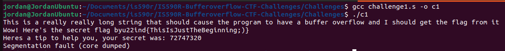

# CTF Challenge Solutions

## Challenge 1
### Step 1: Compile and run the program
```bash
gcc challenge1.s -o c1
./c1
```

### Step 2: The Buffer Overflow
If you analyze the assembly file, you will realize that the program is expecting the input from the user to be only 20 characters long. If you input a string that is 24 characters or more, this results in a buffer overflow, which overwrites the "secret" variable.

For this example, I input the following string:
```
This is a really really long string that should cause the program to have a buffer overflow and I should get the flag from it
```

### Step 3: The Flag
After inputting a large string, such as the one given in Step 2, the program will output the flag.

```
Wow! Here's the secret flag byu22ind{ThisIsJustTheBeginning;)}
Heres a tip to help you, your secret was: 72747320
Segmentation fault (core dumped)
```

### Screenshot



<br/>
<br/>
<br/>


## Challenge 2
### Step 1: Compile and run the program
```bash
gcc challenge2.s -o c2
./c2
```

### Step 2: The Buffer Overflow
If you analyze the assembly file, you will discover that the variable "secret" is being compared with the hex value "0x41424344". If secret is set equal to "0x41424344", then the flag will be printed out. Therefore, you need to overwrite the secret value. From the assembly file, we also learn that variable "name" can hold up to 8 characters, before it starts overwriting the variable "secret", along with other things on the stack.

"0x41424344" is "ABCD" in ASCII characters. Now that we know we have 8 characters between our input and the variable secret, we can make an exploit string. Because this machine is little endian, we need to put our characters in reverse order.

I used this string for this example
```
RickRollDCBA
```

The "RickRoll" part doesn't matter, but the "DBCA" does. The "RickRoll" is just to fill up 8 bytes of data.

### Step 3: The Flag
Now that we have inserted our exploit string, the program will give us the flag.

```
Wow! Here's the secret flag byu22ind{ThisIsntEvenMyFinalForm}
Heres a tip to help you, your secret was: 41424344
```

### Screenshot


<br/>
<br/>
<br/>


# Challenge 3
### Step 1: Compile and run the program
```bash
gcc challenge3.s -o c3
./c3
```

### Step 2: The Buffer Overflow
If you analyze the assembly file, you will discover that the variable "secret" is being compared with another variable called "compare". If secret is greater than compare, then the program will print out the flag. We also learn that there are 8 characters we can input until we overwrite the variable "compare", and 12 characters we can input until we overwrite "secret".

If we make an exploit string that gives "secret" a larger value than "compare", then the program will print the flag.

This is the exploit string that I used
```
PlayTimeAAAAZZZZ
```

### Step 3: The Flag
After inputting the exploit string, the program will now print the flag.

```
Dang! This function isn't even callable! I don't know how you pulled this off... but for your work, here's a flag! byu22ind{ICommendYourWork}
Heres a tip to help you, your secret was: 5a5a5a5a
Heres a tip to help you, your comparison was: 41414141
```

### Screenshot
